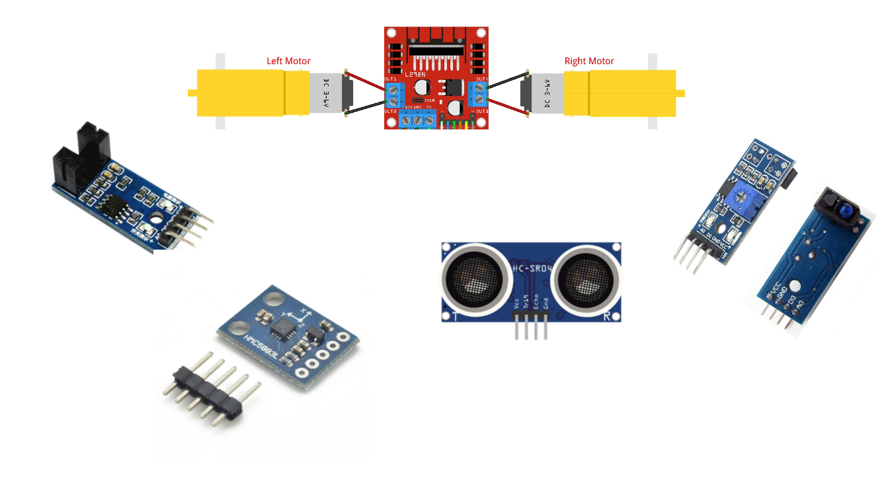
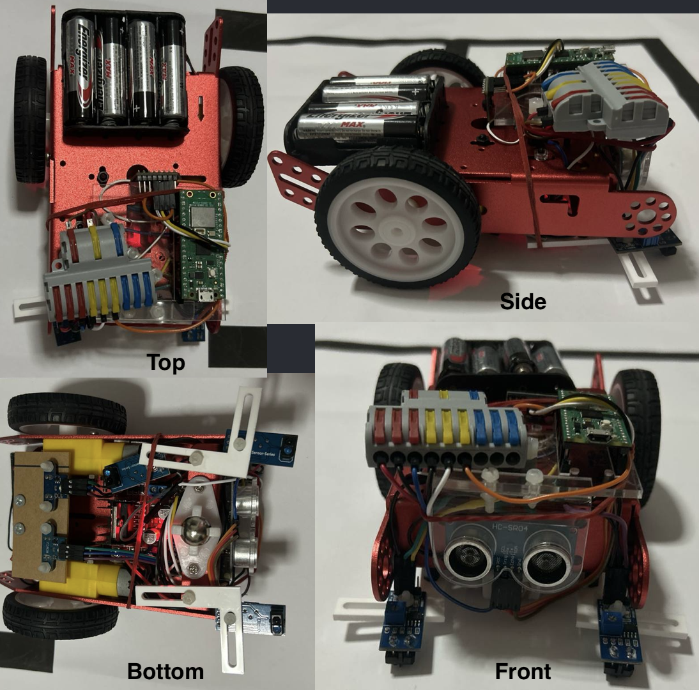
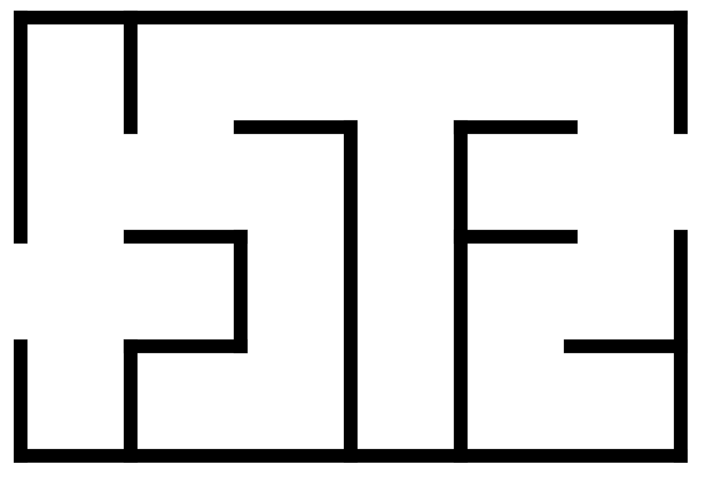

## INF2004 Embedded Systems Team 18: Robot Car

### Members and Task Allocations
**Team Members**  
2200959 Peter Febrianto Afandy  
2201014 Tng Jian Rong  
2201132 Lionel Sim Wei Xian  
2200920 Colin Ng Kar Jun  
2200936 Muhammad Nur Dinie Bin Aziz  

**Task Allocations**  
*2200959 Peter Febrianto Afandy*
- IR Sensor
- Barcode Scanning and Recognition (all 3 sizes), and integration with car
- Side wall detection
- Optimisations

*2201014 Tng Jian Rong*
- User Interface (controls, display of sensor data, map, coordinates)
- PID Controller
- Wifi Communications between web interface and car

*2201132 Lionel Sim Wei Xian*
- Ultrasonic Sensor
- Obstacle detection with integrated Kalman Filter, and integration with car
- Navigation

*2200920 Colin Ng Kar Jun*
- User Interface (controls, display of sensor data, map, coordinates)
- Magnetometer
- Sensor Fusion

*2200936 Muhammad Nur Dinie Bin Aziz*
- Wheel Encoder, Motor, Motor Controller
- Integration of car movement
- Assembly of car and integration of different components together
- Navigation algorithm

### Project Description
---
Our project is focussed on the development of an autonomous two-wheeled robot car using the Raspberry Pi Pico W as the main microcontroller. The car is able to navigate a predefined map efficiently through the use of advanced navigation algorithms. It is also capable of obstacle detection and avoidance and the decoding of barcodes encoded in the Barcode-39 standard. A PID controller has been implemented into the car to ensure smooth executions during its movement, and the fusion of the different sensors enhances the robot car's performance and robustness through improved decision-making and accuracy.

### Program Design
---
Our project comprises of 7 components, each catered for a particular sensor/aspect of the car:
- Navigation and Mapping
- Wifi
- Motor
- Ultrasonic (for obstacle detection)
- IRLine (for barcode decoding)
- Encoder (for car movement)
- Magnetometer (for car direction tracking)

In this section, we will go over the modular design of the car..

### Component List
---
**Ensure that you have the following components!* 

**Raspberry Pi**
- 1 x [Raspberry Pi Pico W](https://www.raspberrypi.com/products/raspberry-pi-pico/)

**Sensors**
- 1 x [Ultrasonic Sensor: HCR04](https://components101.com/sensors/ultrasonic-sensor-working-pinout-datasheet)
- 3 x [IR Sensor](https://sg.cytron.io/p-ir-line-tracking-module)
- 2 x [Wheel Encoder](https://hobbycomponents.com/sensors/1147-compact-ir-infrared-rotary-speed-sensing-module)
- 2 x [Motor Controller: L298N](https://components101.com/modules/l293n-motor-driver-module)
- 2 x Motor
- 1 x [Magnetometer: GY-511](https://quartzcomponents.com/products/gy-511-lsm303dlhc-3-axis-e-compass-sensor)

**Hardware**
- 2 x Car Wheels
- 1 x Car Chassis
- 1 x Wire Splitter
- 1 x Battery Holder
- 4 x AA Batteries
- Mounting Plates
- Nuts and Bolts
- Jumper Cables (M-M, F-F, M-F)

### Getting Started
---
1. Ensure that all the necessary hardware components are connected to the correct pins on the Raspberry Pi Pico W, and configured properly. Your final car should look something like this:
    
2. Compile and build `main.c`, and its required dependencies (all handled in its `CMakeLists.txt`). Make sure to configure the Wifi SSID and password to connect to your desired network.
3. Flash your Raspberry Pi Pico W with the generated `.uf2` file!
4. Place the car on a maze map! You can generate a map from [here](https://www.mazegenerator.net/). Your map should look something like this:
    
5. On a browser, navigate to the car's IP address, then click start!
6. Let the car run! 🏎️